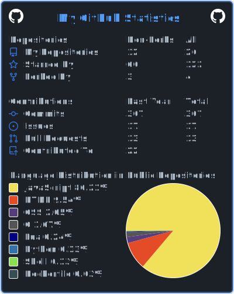

 <h3 align="center">
  Hi, I'm OMEGA
 

 
 <h4 align="center"> Pronouns: He/Him </h4>
 
 
  

 
  <dt>
          <dt>
            

         
        </dt>

  <h3 align="center">Best 7th grader in Robious Middle School</h3>
 
  

	  
- 🔭 I’m currently working on [My Readme](https://github.com/OMEGA6404/OMEGA6404)

- 🌱 I’m currently learning **C#, C and PHP**

- 👯 I’m looking to collaborate on [Youtube](https://www.youtube.com/@OMEGA_GD)

- 🤝 I’m looking for help with **My Github Readme**

- 💬 Ask me about **Anything**

- 📫 How to reach me **Jackguiveroulie@gmail.com**

- ⚡ Fun fact **I can solve a Rubix cube**

<h3 align="left">Connect with me:</h3>

<h3 align="left">Languages and Tools:</h3>

         

 
  ## 🔥 Streak stats

  

  
	
  ## 🏆 Awards

 
      
  ## 📊 Github Stats
     
   
    
  
   
  
  
   
   ## Github Summary Cards
   

	

 
 
	

	
   ## 📈 Activity Graph

	
	
  
   

<h12>
Copyright © 1991, 1999 Free Software Foundation, Inc.
